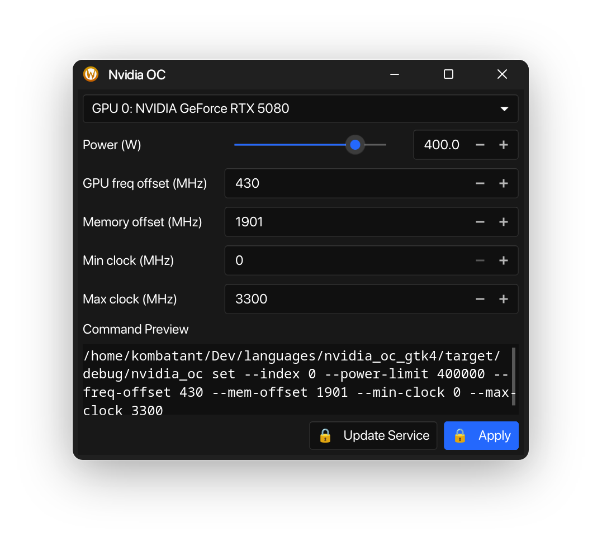

# NVIDIA_OC

NVIDIA_OC is a simple Rust CLI tool designed to overclock NVIDIA GPUs on Linux. This tool was developed to support both X11 and Wayland environments, addressing a gap in existing overclocking tools that only support X11.

## GTK4 GUI

Used an LLM to do the following:

- Added optional GTK4 GUI available when building and running with the `--features gui` (or launching the program with the `--gui` parameter). The GUI provides controls for GPU overclocking settings including power, GPU frequency offset, memory offset, and min/max clocks.
- The UI displays power in watts (`W`) to the user, while the underlying CLI and systemd service still use milliwatts (`mW`). The GUI converts UI watt values to milliwatts when constructing commands.
- `main.rs` was updated to handle launching the GUI when requested via command line arguments or environment variables.
- Added a service creation/update flow: the GUI can write a systemd unit for `nvidia_oc` and will run the required privileged steps under a single elevation request (via `pkexec`) so the user is prompted for elevation only once. Temporary files used during the flow are cleaned up after completion.

Example (rendered) screenshot included below:



## Command Line

### Example Usage

To set the overclock parameters for your NVIDIA GPU, use the following command:

```bash
./nvidia_oc set --index 0 --power-limit 200000 --freq-offset 160 --mem-offset 850 --min-clock 0 --max-clock 2000
```

### Run on Startup

To ensure NVIDIA_OC runs on startup, follow these steps:

1. Download the binary file from the [latest release](https://github.com/Dreaming-Codes/nvidia_oc/releases/).
2. Store the binary file in a secure location.
3. Create a systemd service file at `/etc/systemd/system/nvidia_oc.service` with the following content:

```service
[Unit]
Description=NVIDIA Overclocking Service
After=network.target

[Service]
ExecStart=[path_to_binary]/nvidia_oc set --index 0 --power-limit 200000 --freq-offset 160 --mem-offset 850 --min-clock 0 --max-clock 2000
User=root
Restart=on-failure

[Install]
WantedBy=multi-user.target
```

Replace `[path_to_binary]` with the actual path where the binary is stored.

To create this file, you can run:

```bash
sudo nano /etc/systemd/system/nvidia_oc.service
```

Paste the content above, then press `Ctrl + X`, `Y` to confirm saving, and `Enter` to confirm the file path.

4. Reload the systemd manager configuration:

```bash
sudo systemctl daemon-reload
```

5. Enable and start the service immediately:

```bash
sudo systemctl enable --now nvidia_oc
```